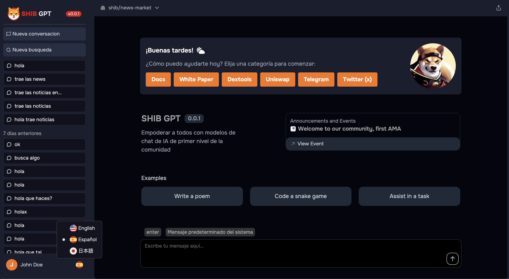

# Key Features & Capabilities

In this section, we delve into the key features and capabilities of SHIB GPT, highlighting its unique strengths and functionalities.

## Advanced Natural Language Processing

SHIB GPT is equipped with advanced natural language processing (NLP) capabilities, enabling it to understand and interpret human language with remarkable accuracy. From sentiment analysis to language translation, SHIB GPT excels in a wide range of NLP tasks.

## Real-Time Data Analysis

With real-time data analysis capabilities, SHIB GPT provides instantaneous insights from large volumes of data. Whether it's processing streaming data or analyzing historical datasets, SHIB GPT ensures timely and relevant information for decision-making.

## Multilingual Support

SHIB GPT offers robust multilingual support, facilitating seamless communication across different languages and dialects. Its translation capabilities foster global interactions, breaking down language barriers and promoting collaboration.

## Adaptability and Customization

One of SHIB GPT's key strengths is its adaptability and customization. Users can tailor the model to suit specific use cases and industries, leveraging its flexibility to address diverse needs and requirements.

## Contextual Understanding

SHIB GPT excels in understanding context, generating coherent and contextually relevant responses. Whether it's chatbots providing personalized assistance or content generation for specific audiences, SHIB GPT ensures meaningful interactions.

## Continuous Learning

Through continuous learning mechanisms, SHIB GPT evolves and improves over time. It leverages feedback loops and new data to refine its understanding and enhance performance, staying up-to-date with evolving trends and preferences.

## Scalability and Performance

With its scalable architecture and high-performance computing capabilities, SHIB GPT can handle large-scale deployments and complex computational tasks. Whether it's serving thousands of users simultaneously or processing massive datasets, SHIB GPT delivers reliable performance.

## Integration and Compatibility

SHIB GPT seamlessly integrates with existing systems and platforms, ensuring compatibility with a wide range of applications and technologies. Its open architecture and API support enable easy integration into workflows and processes.

## Security and Privacy

Security and privacy are paramount in SHIB GPT, with robust measures in place to protect sensitive data and ensure user confidentiality. From encryption techniques to access controls, SHIB GPT prioritizes security at every level.

## User-Friendly Interface

Despite its advanced capabilities, SHIB GPT features a user-friendly interface that makes it accessible to users of all technical backgrounds. Its intuitive design and interactive features enhance user experience, empowering users to leverage its capabilities effectively.

This section provides an overview of the key features and capabilities of SHIB GPT, demonstrating its versatility and potential across various domains and applications.
