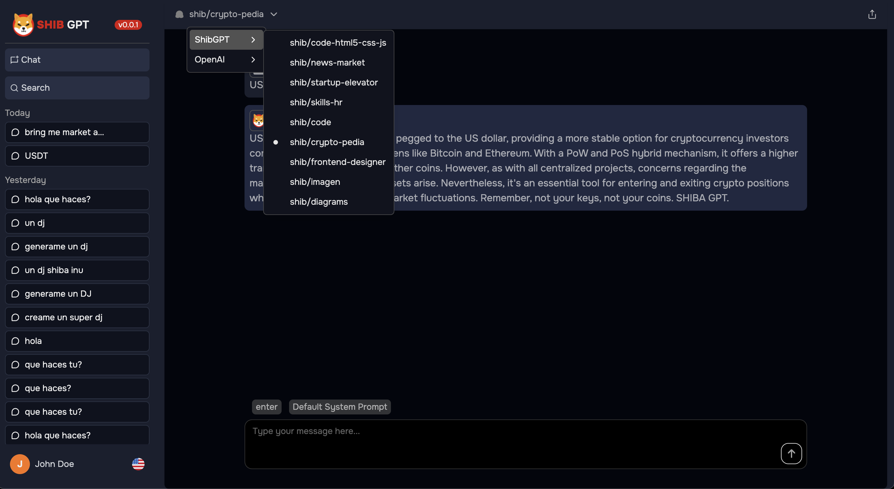

# Real-World Applications

In this section, we explore practical applications and use cases for our Language Model (LLM). With a diverse range of LLMs available, catering to various domains including news, design, programming, drawing, diagrams, teaching, psychology, finance, and more, the possibilities are endless. Let's take a glimpse into some of the key applications:

## 1. News Analysis and Summarization

Our LLM excels in analyzing and summarizing news articles, providing concise and insightful summaries for users to stay informed efficiently.

## 2. Design Assistance

From generating design concepts to offering creative suggestions, our LLM serves as a valuable assistant for designers, enhancing their workflow and creativity.

## 3. Programming Support

With its advanced programming knowledge, our LLM provides support and guidance to programmers, helping them troubleshoot issues and develop efficient code.

## 4. Drawing and Artistic Inspiration

Creativity knows no bounds with our LLM, offering inspiration and guidance to artists and creators in their drawing and artistic endeavors.

## 5. Diagram Generation

Need to create diagrams or visual representations? Our LLM generates accurate and detailed diagrams based on your inputs, simplifying complex concepts.

## 6. Teaching Assistance

Teachers can leverage our LLM for lesson planning, content creation, and student engagement, enhancing the teaching experience and fostering interactive learning environments.

## 7. Psychological Support

Our LLM offers psychological insights and support, assisting psychologists in therapy sessions, research, and analysis of patient data.

## 8. Financial Analysis

For financial professionals, our LLM provides valuable insights and analysis, facilitating decision-making processes and market predictions.

## 9. Code Generation

Automate your coding tasks with our LLM, which generates code snippets and solutions tailored to your requirements, speeding up development processes.

## 10. Language Translation

Breaking language barriers, our LLM offers seamless translation services, enabling communication across different languages and cultures.

These are just a few examples of the practical applications and use cases for our Language Model. With its versatility and adaptability, our LLM revolutionizes various industries and domains, empowering users to achieve their goals effectively and efficiently.
